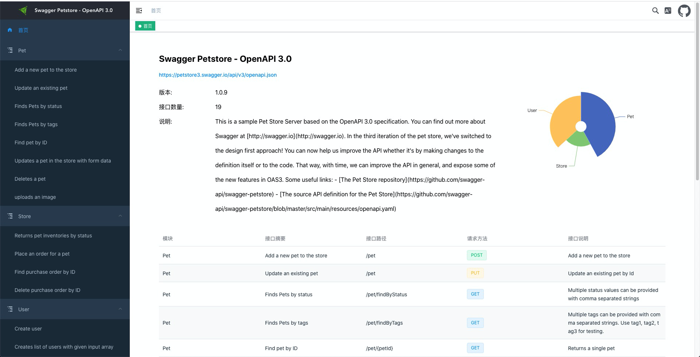
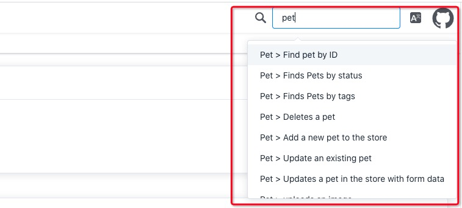
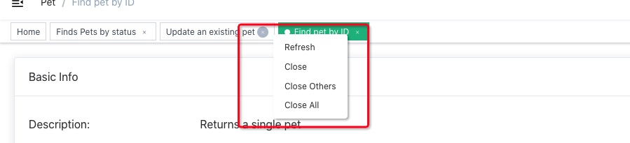

# go-doudou-openapi-ui
This is an OpenAPI3.0 specification UI project written by vuejs+typescript stack inspired by [redoc](https://github.com/Redocly/redoc) . Currently, it supports json format spec only, yaml support is coming soon.


## Usage
Clone the repo.
```
git clone git@github.com:unionj-cloud/go-doudou-openapi-ui.git
```
Install dependencies and start the project, then browser will be opened automatically.
```shell
yarn install && yarn serve
```

Add `?docUrl=${OAS3_SPEC_LINK}` to `http://localhost:9527/#/index` and click `enter`, online documentation will display.  

NOTE: `${OAS3_SPEC_LINK}` must support cors visit.

## Screenshot



